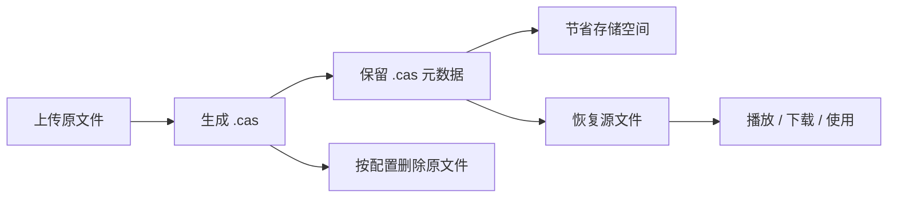

<div align="center">
  

  <p><em>OpenList 是一个有韧性、长期治理、社区驱动的 AList 分支，旨在防御基于信任的开源攻击。</em></p>

  
  <a href="https://github.com/OpenListTeam/OpenList/blob/main/LICENSE"></a>
  <a href="https://github.com/OpenListTeam/OpenList/actions?query=workflow%3ABuild"></a>
  <a href="https://github.com/OpenListTeam/OpenList/releases"></a>

  <a href="https://github.com/OpenListTeam/OpenList/discussions"></a>
  <a href="https://github.com/OpenListTeam/OpenList/releases"></a>
</div>

---
# OpenList-CAS

基于 [OpenList](https://github.com/OpenListTeam/OpenList) 的非官方增强版本，围绕 `.cas` 元数据文件提供生成、恢复、自动恢复与临时播放文件能力。

## ✨ TL;DR

- 📦 上传普通文件后可自动生成 `.cas`
- 🗑️ 可在生成 `.cas` 后自动删除源文件
- ⚡ 可通过 `.cas` 快速恢复原文件
- 🗑️ 可在恢复原文件后自动删除 `.cas` 文件
- 🎬 支持通过 `.cas` 恢复临时播放文件并进行视频播放
- ♻️ 删除源文件、`.cas` 文件和临时播放文件时同步清理回收站

---

## 🧠 核心理念

> 用“可验证的文件特征”替代“文件本体存储”，在尽量降低存储占用的同时，保留文件恢复能力。

---

## 🔄 工作流程

> 上传 → 提取特征 → 生成 `.cas` → 按需删除原文件 → 需要时恢复



---

## 🚀 使用场景

- 📉 **低存储环境**
  仅保留 `.cas`，显著减少空间占用

- ☁️ **网盘秒传恢复**
  通过哈希特征恢复文件，避免重复上传

- 🎬 **媒体库归档**
  平时只保留 `.cas`，需要时再恢复并播放

- 🔁 **自动化工作流**
  自动扫描监控目录中的 `.cas` 并恢复源文件

---

## 🔧 核心特性

- 自动生成 `.cas` 元数据文件
- 支持生成 `.cas` 后自动删除源文件
- 支持从 `.cas` 恢复原文件
- 恢复命名默认按当前 `.cas` 文件名处理
- 支持恢复成功后自动删除 `.cas`
- 支持自动扫描监控目录并恢复已有 `.cas`
- 支持 `.cas` 作为视频播放入口
- 支持删除时同步清理回收站
- 支持家庭传输联动，减少个人空间上传流量限制影响

---

## ⚙️ 配置说明

### 189CloudPC

| 配置项 | 默认值 | 说明 |
| --- | --- | --- |
| `Generate cas` | `false` | 上传文件后生成 `.cas` 文件 |
| `Delete source` | `false` | 生成 `.cas` 文件成功后自动删除源文件，并同步清理回收站中的源文件 |
| `Restore source from cas` | `false` | 处理 `.cas` 文件时，自动根据其中记录的信息恢复源文件 |
| `Delete CAS after restore` | `false` | 恢复成功后自动删除 `.cas` 文件，并同步清理回收站中的 `.cas` 文件 |
| `Auto restore existing cas` | `false` | 开启后会自动扫描监控目录中的 `.cas` 文件并尝试恢复源文件 |
| `Auto restore existing cas paths` | 空 | 每行一个路径，只监控这些目录及其子目录；留空则不监控 |

### Local

| 配置项 | 默认值 | 说明 |
| --- | --- | --- |
| `Generate cas` | `false` | 上传文件后生成 `.cas` 文件 |
| `Delete source` | `false` | 生成 `.cas` 后删除源文件 |

---

## 📦 支持驱动

| 驱动 | 生成 `.cas` | 删除源文件 | 从 `.cas` 恢复 | 自动恢复 | 删除 `.cas` 文件 | `.cas` 视频播放 |
| --- | --- | --- | --- | --- | --- | --- |
| `189CloudPC` | ✅ | ✅ | ✅ | ✅ | ✅ | ✅ |
| `Local` | ✅ | ✅ | ❌ | ❌ | ❌ | ❌ |

---

## 🖥️ 驱动说明

### ☁️ 189CloudPC

支持：

- 生成 `.cas`
- 生成 `.cas` 文件后删除源文件
- 从 `.cas` 文件恢复源文件
- 自动恢复监控目录 `.cas` 文件
- 从 `.cas` 文件恢复源文件后删除 `.cas` 文件
- `.cas` 视频播放
- 删除时同步清理回收站

说明：

- 依赖云端侧可用的恢复能力
- 播放 `.cas` 时，会先临时恢复文件到 `/TEMP`
- 恢复出的临时文件会用于获取真实播放链接并进行播放
- 播放后会自动清理临时文件及回收站中的对应文件

### 💻 Local

支持：

- 生成 `.cas`
- 删除源文件

不支持：

- 从 `.cas` 恢复
- 自动恢复
- `.cas` 视频播放

说明：

- 本地存储不具备云盘式恢复能力
- `.cas` 在 Local 中主要用于节省空间，不用于恢复

---

## 👨‍👩‍👧‍👦 关于家庭传输

`FamilyTransfer` 是 `189CloudPC` 原版已有能力，不是 CAS 新增功能。

开启后：

- 普通上传可通过家庭空间中转，减少个人空间上传流量限制影响
- 在 `Generate cas + Delete source` 组合下，可只在个人空间保留 `.cas`
- 临时播放文件恢复也会跟随家庭传输逻辑走家庭侧中转

---

## 🎬 临时播放文件说明

`.cas` 本身不是视频文件，不能直接播放内容本体。

实际流程是：

1. 点击 `.cas`
2. 恢复临时播放文件到 `/TEMP`
3. 获取真实视频链接
4. 开始播放
5. 播放链拿到链接后删除临时文件，并同步清理回收站中的对应文件

临时播放文件命名格式：

```text
TEMP_12345_movie.mkv
```

---

## 🏷️ 命名规则

### 生成 `.cas`

```text
movie.mkv -> movie.mkv.cas
```

### 恢复源文件

恢复时默认按当前 `.cas` 文件名推导目标名，并保留原文件扩展名。

例如：

```text
abc.mp4.cas -> abc.mkv
test.cas -> test.mkv
```

---

## 🐳 部署指南

默认端口：

```text
5244
```

默认数据目录：

```text
/opt/openlist/data
```

### Docker

```bash
docker run -d --restart=unless-stopped \
  -v /etc/openlist:/opt/openlist/data \
  -p 5244:5244 \
  -e PUID=0 \
  -e PGID=0 \
  -e UMASK=022 \
  --name="openlist-cas" \
  freeyua/openlist-cas:latest
```

### Docker Compose

```yaml
services:
  openlist-cas:
    image: freeyua/openlist-cas:latest
    container_name: openlist-cas
    restart: unless-stopped
    ports:
      - "5244:5244"
    volumes:
      - ./data:/opt/openlist/data
    environment:
      - PUID=0
      - PGID=0
      - UMASK=022
```

---

## 🌐 访问地址

```text
http://localhost:5244
```

---

## ⚠️ 重要说明

`.cas` 只保存恢复所需特征，不保存原文件数据。

这意味着：

- ✅ 云端仍可命中恢复能力时，可以恢复
- ❌ 云端文件失效、被清理、被风控时，可能无法恢复
- ❌ `.cas` 不能代替完整备份

请不要将 `.cas` 作为唯一长期备份方案。

---

## ❓ 常见问题

### `.cas` 是备份吗？

不是，`.cas` 只是元数据描述，不包含原文件本体。


### 为什么 Local 不支持恢复？

因为本地存储不具备这套恢复链依赖的能力。

### 开启家庭传输后有什么作用？

可以通过家庭空间中转上传，减轻个人空间上传流量限制影响。

---

## 🔗 与上游项目

- 上游项目：[OpenList](https://github.com/OpenListTeam/OpenList)
- 上游项目：[openlist4.1.10](https://github.com/1307super/openlist4.1.10) 
- 本项目为非官方增强分支

---

## 📜 免责声明

1. 本项目仅用于学习与技术研究。
2. 请遵守相关法律法规及服务条款。
3. 使用本项目产生的风险由使用者自行承担。
4. 本项目为非官方修改版本，不代表上游项目立场。

---

## 📜 致谢 & 声明

* 感谢原项目 [OpenList](https://github.com/OpenListTeam/OpenList) 提供的基础能力。
* 感谢原魔改项目 [openlist4.1.10](https://github.com/1307super/openlist4.1.10) 提供的基础生成 `cas`文件能力。
* 本项目为非官方增强分支

⚠️ **仅供学习研究，请遵守法律法规**

---

## ⭐ Star History

如果这个项目帮到了你，欢迎点个 ⭐ 支持！
